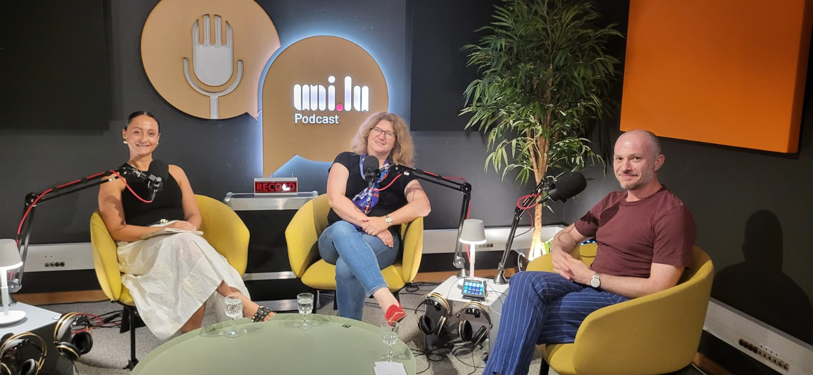
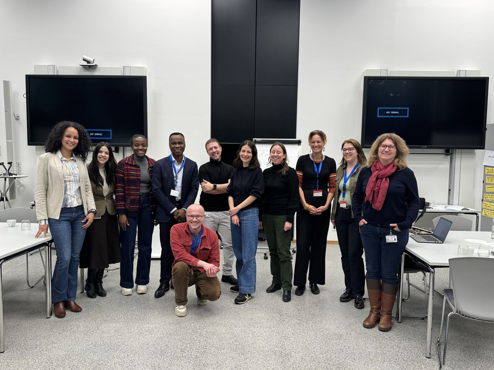
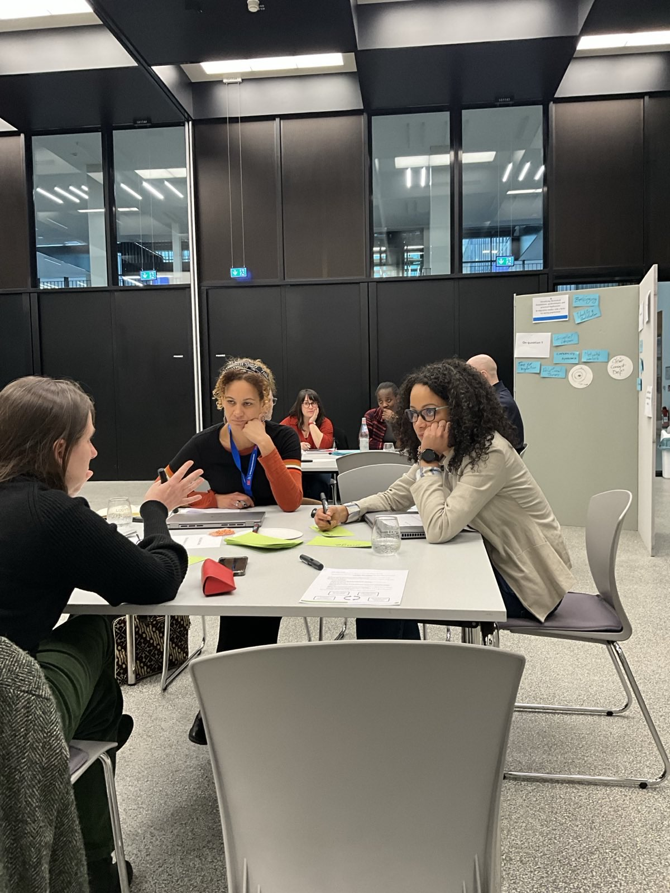
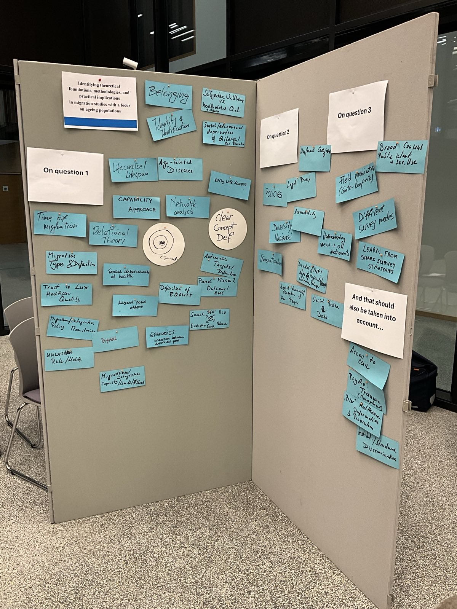

<!-- Google tag (gtag.js) -->

GOLD* stands for _Growing old in a foreign country_. 

The term has a double meaning. 

First, it is meant to represent the golden age in our lifespan--the old age. 

Second, it is a referral to the gold rush in the 19th century when many people migrated to other countries and continents in search of a better life.

GOLD* is therefore an initiative that focuses on the study of health, healthcare needs and limitations of older migrants. This initiative has formed as a follow-up to the PSOAMLux event (see below).

## Teaser to the GOLD* Podcast

{.lightbox width=65%}

On June 29th, 2026, we recorded the second episode of the GOLD* podcast. 

Angela Malerba (Director of Zitha Mobile, a healthcare provider in Luxembourg) and Prof. Isabelle Albert (University of Luxembourg) were the invited experts. Together we discussed the topic of _specifics of healthcare needs of older migrants in culturally diverse societies._

Although the podcast series is not yet launched (we will record a couple more episodes before the publication), I am excited to share this photo from the recording room. The podcast infrastructure, networking, and concept is now established so there will be more episodes to come soon. International and local experts will come together with representatives of public and private institutions as well as the community, to discuss topics relevant to _people who grow old in a foreign country_. 

Our mission is to help bridge the gap between recent scientific findings, the healthcare sector, and the general public. Which may be you, me, and anyone who is or has a relation with someone living and growing old in a different country than the one where they were born in. 

Our goal is to launch the GOLD* Podcast in video and audio format via the traditional channels such as Spotify, Apple Podcast, and YouTube! 

## PSOAMLux event

{.lightbox width=50%}

PSOAMLux is short for Panel Study of Older and Ageing Migrants in Luxembourg. PSOAMLux is an event funded by the University of Luxembourg Institute of Advanced Study ([IAS](https://www.uni.lu/research-en/ias/)) through the BRAINSTORM instrument.

PSOAMLux brought together a group of international and local experts and community representatives to discuss ways forward in assessing and evaluating the life experience and healthcare needs of migrant older populations. 

Presentations on pre-determined topics, for instance, "ageing and migration", "digital health technology", and "ethics, legal, and data-related" created a common knowledge base for the workgroup. This knowledge base was leveraged in a guided brainstorm discussion on four pre-determined questions:

+ What are relevant theories, methodologies and practical issues to study? 
+ What are possibilities and obstacles to complementing self-reports with more objective data sources such as digital data and biomarkers?
+ What are appropriate sampling and recruitment strategies?
+ What ethical, legal and data-management issues need to be considered?

:::{layout-ncol=2} 
{.lightbox width=75%}

{.lightbox width=75%}
:::

The event discussions have generated a rich knowledge base that the workgroup plans to use to further research, attract funding, and continute the discussion with different stake holders.