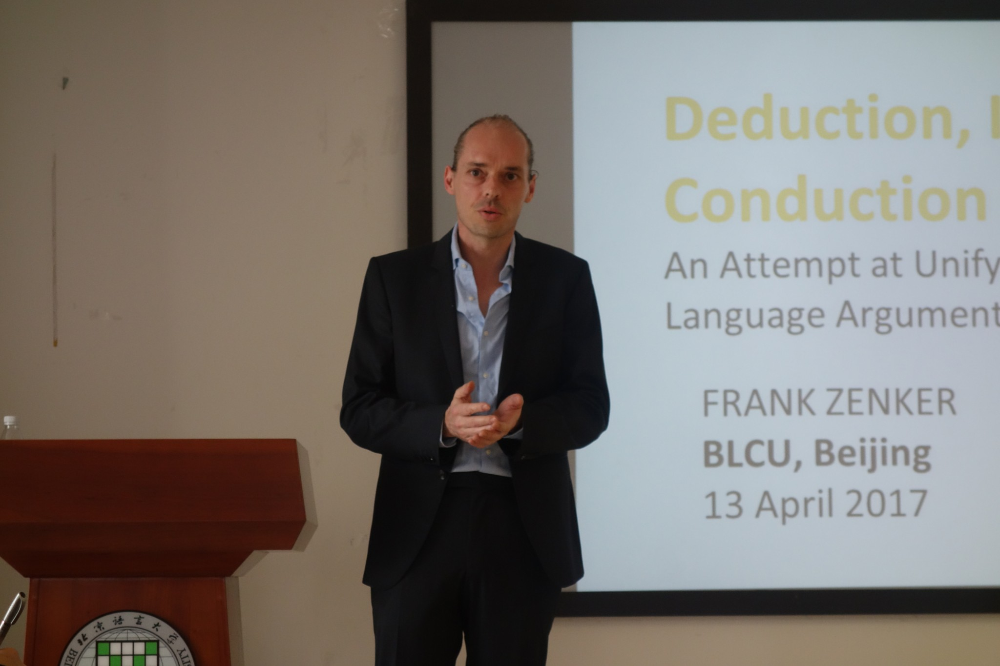

___

[{ width=35% align="" title="Dr. Zenker"}](https://mtrboun.wordpress.com/)

Colleague Frank (Dr. Zenker) of the BOUN University Istanbul (Turkey) and Warsaw University (Poland) visits GESIS in Mannheim for further developing our collaborative projects on improving research practices in the social sciences. 

Dr. Zenker has published extensively on topics addressing the philosophy of science as well as on strategies towards developing a research programm approach in ensuring hightened replicability and validity of scientific progress. You can see a list of Dr. Zenker's publications on his Google Scholar profile [here](https://scholar.google.com/citations?user=YL_hINYAAAAJ).

Between **21.02.2022 - 25.02.2022** Frank and I will be working on reviewing the manuscript "The similarity index: A simple deductive measure to evaluate the empirical adequacy of a theoretical construct", currently published as a pre-preint at PsyArXiv (see [here](https://psyarxiv.com/gdmvx/)) and co-authored with [Dr. Erich H. Witte](https://www.psy.uni-hamburg.de/personen/prof-im-ruhestand/witte-erich.html). 

In addition, we will also work on developing a quantum-like approach in correcting for instrument and measurement errors in the social sciences. A shiny-app for the project is being periodically updated (work in progress), but it is already available online for those who want to get a glimpse of what we are working on (see [here](https://adrian-stanciu.shinyapps.io/quantapsych/)).   

___

