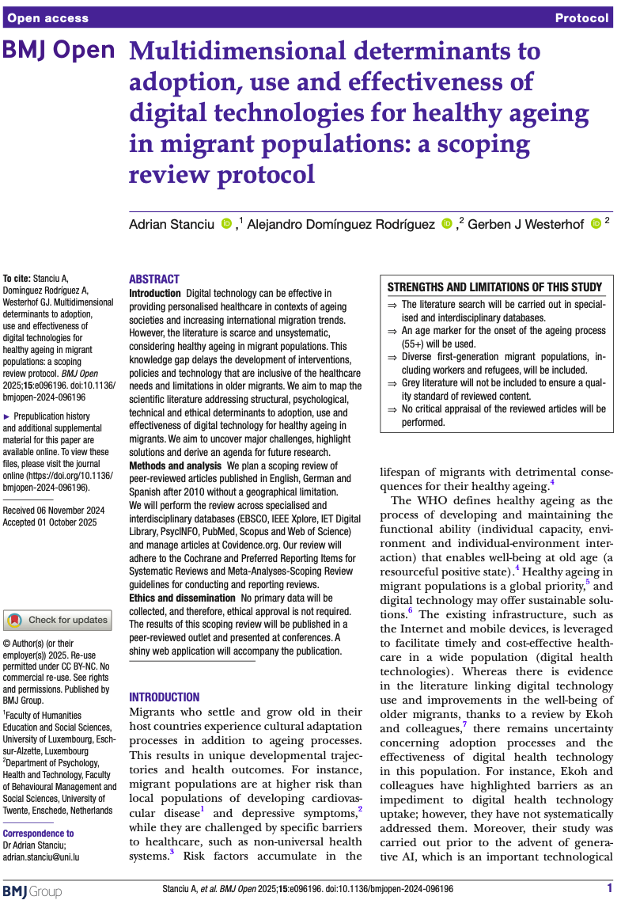

<!-- Google tag (gtag.js) -->

[Study protocol published]{style="font-size: 1.5em; color: #8b0000"} 

Presents the protocol for a scoping review of the scientific literature. The aim is to map existent evidence on what determines adoption, use, and effectiveness of digital technology for healthy ageing in migrants. 

[{.lightbox width=50% fig-align="center"}](https://bmjopen.bmj.com/content/15/10/e096196)

