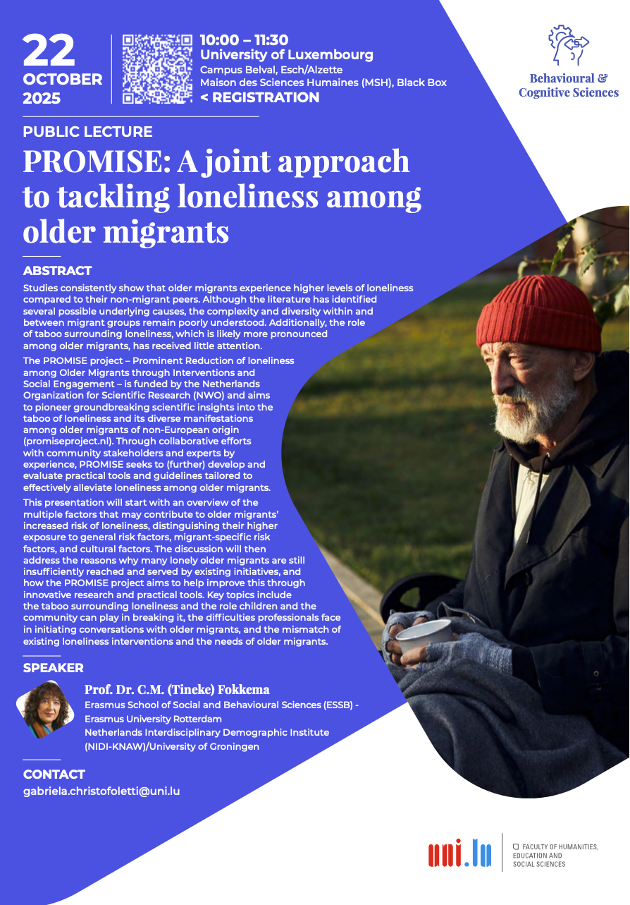
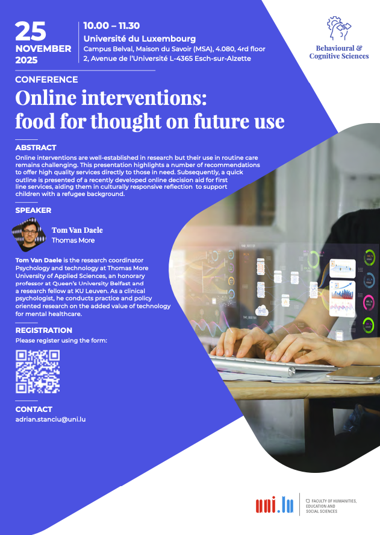

<!-- Google tag (gtag.js) -->

[Incoming visits to University of Luxembourg]{style="font-size: 1.5em; color: #8b0000"} 

{.lightbox width=55%}

October, 2025 -- Prof. Dr. C. M. [(Tineke) Fokkema](https://www.eur.nl/en/news/tineke-fokkema-endowed-professor-ageing-families-and-migration) will visit the institute of Lifespan Development, Family and Culture and, among other, hold a public lecture on researching loneliness in older migrants. 

{.lightbox width=55%}

November, 2025 -- Dr. [Tom van Daele](https://epsychology.be/en/) will visit our institute and give both a public lecture and a workshop focusing on best practices when developing and implementing online interventions. 

