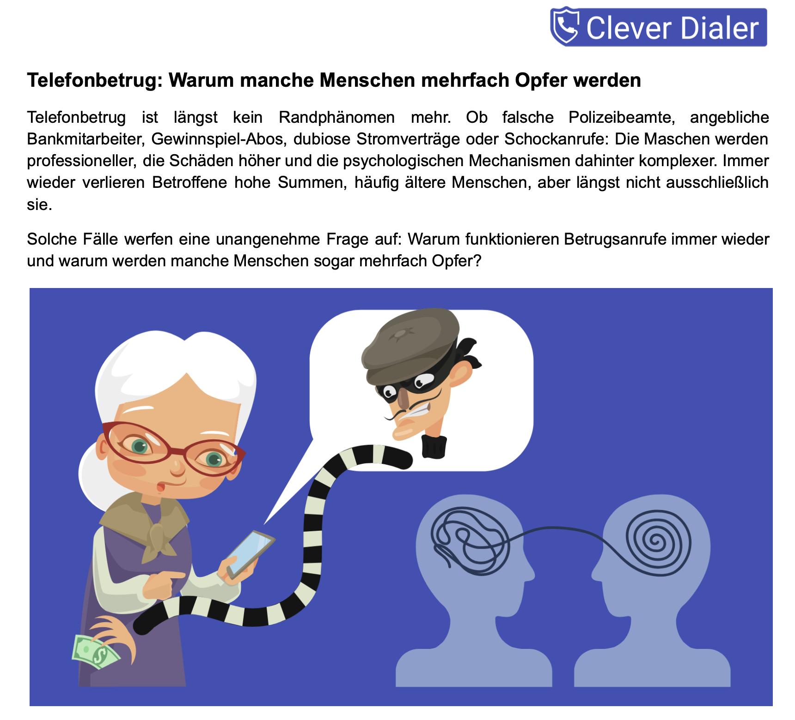

<!-- Google tag (gtag.js) -->

[Interview in the media on phone scams, loneliness, and older people]{style="font-size: 1.5em; color: #8b0000"} 

{.lightbox fig-align=center}

In an interview with Linus Burkel from Mashup Communications, I talked about psychological explanations to why it is often the case that older people who have once been the victim of scams are likely to fall again into the traps set by scammers. 

I drew on theories such as the Self-Determination Theory (read [here](https://www.simplypsychology.org/self-determination-theory.html) a non-scientific overview) and suggested that scammers have the skill to identity and fill in the gaps in peoples' needs for autonomy, competence and relatedness. 

Vulnerability then is almost never a characteristic of the individual. Vulnerability emerges, I argued, in complex interactions of limited personal resources, un-accommodating social environments and non-inclusive societal structures. 

Read the entire interview in German [here](https://www.simplypsychology.org/self-determination-theory.html).

Our interview was further taken up by other media outlets. For instance, the german language version of the magazine Chip. See [here](https://www.chip.de/news/cyber-security/an-solche-luecken-koennen-betrugsversuche-andocken-psychologe-erklaert-wer-besonders-oft-opfer-von-telefon-scam-wird_1762ce6a-707a-4446-af23-11a3448f6d6d.html).