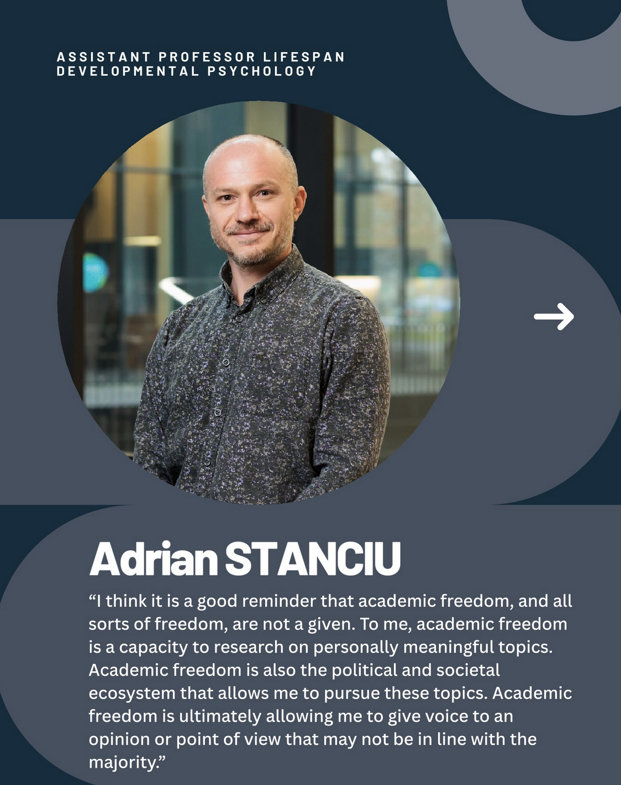
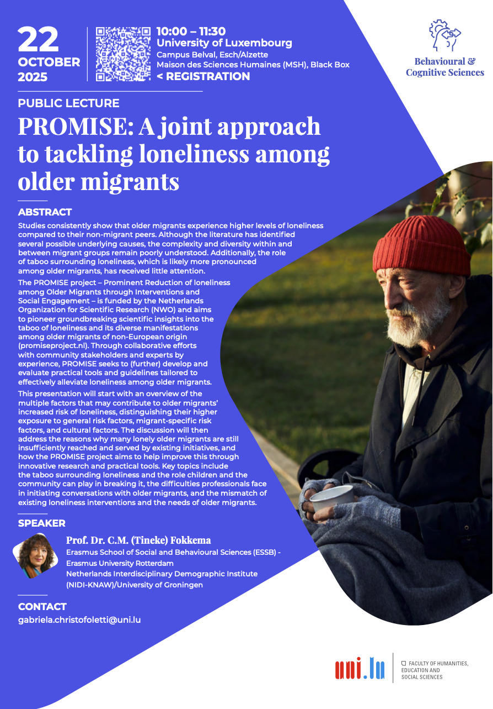
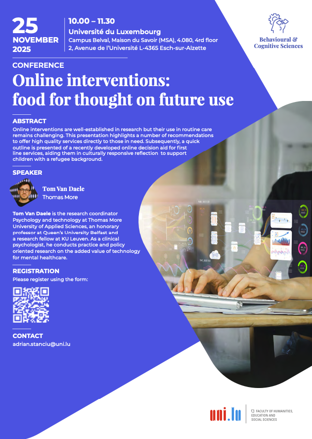
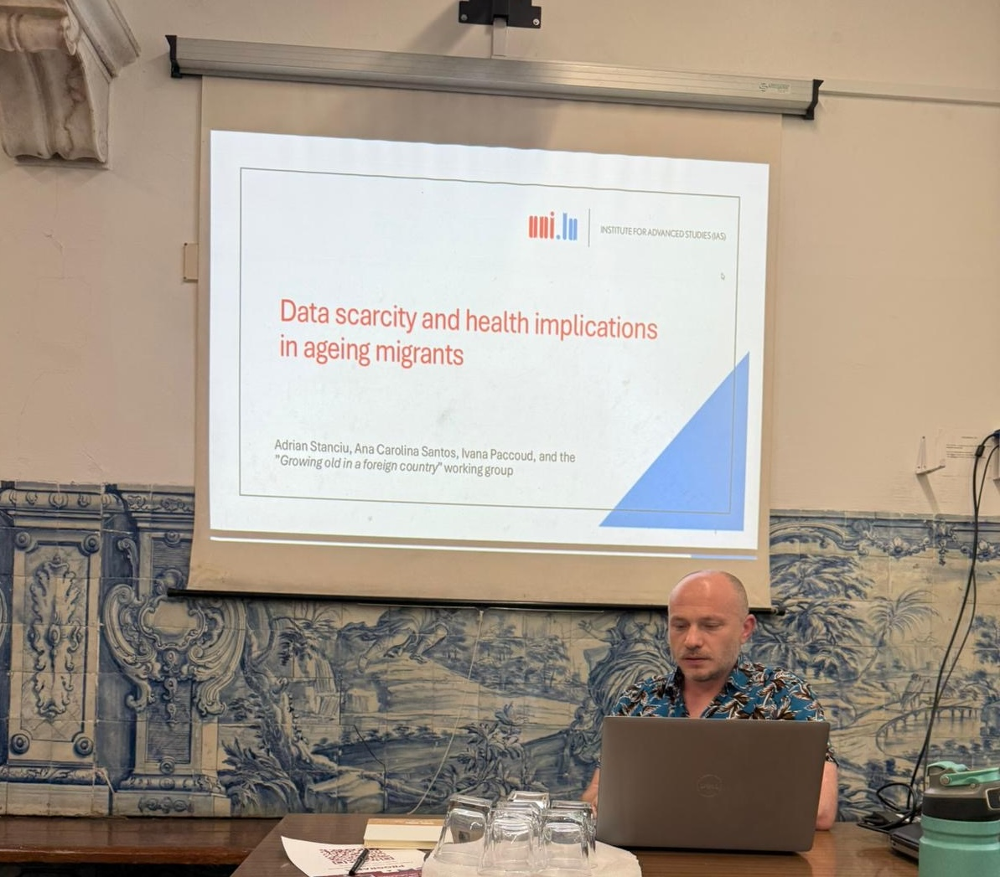
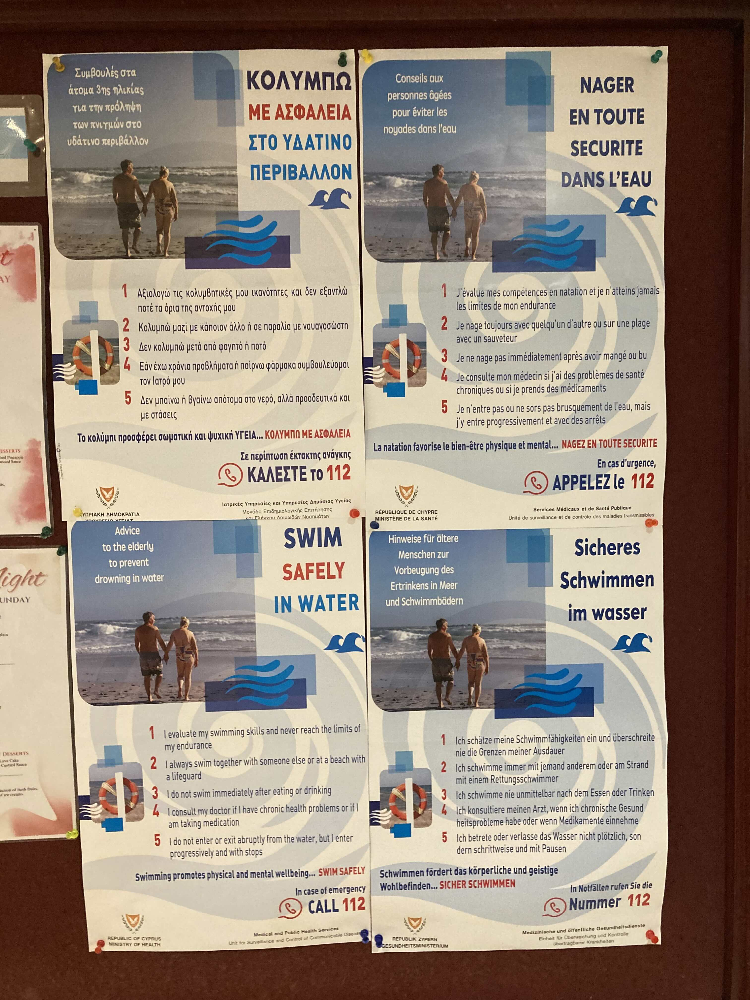

<!-- Google tag (gtag.js) -->

### September 2026

[Third-party funded project take-over]{style="font-size: 1.5em; color: #8b0000"} 

{.lightbox fig-align=center}

I took over PI responsibilities on project [DYNAMIQUES](https://www.uni.lu/fhse-en/research-projects/dynamiques-dynamics-in-students-momentary-perceptions-of-instructional-quality-in-everyday-school-life/) from [Christoph Niepel](https://uol.de/en/agpp/mitarbeiter/prof-dr-christoph-niepel) (now at University of Oldenburg, Germany). The project aims to understand students’ perceptions of instructional quality -- SPIQ -- and how they relate to learning and motivation. 

The project is funded by the Luxembourg National Research Fund ([FNR](https://www.fnr.lu/)).

Over the past few months, the field work in schools in Germany and Luxembourg had been carried out by doctoral candidate Karen Krüger. At the end of July this important milestone has been finalized and the team will now focus on cleaning the data and perform analyses. 

The project addresses four objectives: understanding the multilevel structure of SPIQ, investigating within-person processes, exploring heterogeneity in within-person dynamics, and examining the generalizability of findings across schools in the studied contexts. The findings will help expand our understanding of how students’ experience of instruction affects their learning processes.

The project results will be presented to the public in an organized event tentatively planned for Spring 2027. Moreover, a digital resource as a follow-up to the research efforts is in development with the MEDIA Center at the University of Luxembourg.

### August 2026

[May 20, the International Academic Freedom Day]{style="font-size: 1.5em; color: #8b0000"} 

On May 20 is celebrated the International Academic Freedom Day. 

Some of my colleagues and I have shared what academic freedom means to us, and we all highlight the essential role of science in, sometimes, and especially in challenging times, voicing opinions and perspectives that may not align with those of the majority.

See the full post on the university website: <https://www.uni.lu/en/news/why-is-academic-freedom-essential-for-researchers-and-professors/>

Also availabe on LinkedIn: <https://www.linkedin.com/feed/update/urn:li:activity:7462881107441799168/>

{.lightbox width=50% fig-align="center"}

### May 2026

[BRAINSTORM workshop on the impact of AI on ageing at work]{style="font-size: 1.5em; color: #8b0000"} 

[{.lightbox width=50% fig-align="center"}](https://www.uni.lu/fdef-en/events/aigeing-at-work-the-impact-of-ai-on-ageing-at-work/)

**Abstract**

The increasing adoption of artificial intelligence (AI) at work is radically transforming the workplace dynamics, labour processes, and working conditions of workers at all career stages. Despite the vast body of scholarship exploring the quantitative and qualitative impact of such a transformation, little attention has been devoted to the role of age in shaping the workers’ experiences with AI tools. Anecdotal evidence demonstrates that two age groups, namely “young” and “aged” workers, are particularly exposed to AI risks, albeit in distinct ways and for different reasons. AI may exacerbate the existing systemic barriers that both groups have been facing before the advent of the latest technology wave, as well as it may generate new, AI-specific risks that still have to be uncovered and analysed through an innovative multi-disciplinary lens. Current regulatory frameworks fail to take account of these vulnerabilities specific to workers’ life stages.

By gaining a multi-disciplinary understanding of the relationship between workers’ age and the AI adoption at work and mapping the risks related to “algorithmic ageism”, the A(I)geing@Work workshop will contribute to designing fair, adequate, and responsive policy measures. Innovative policy approaches are needed to mobilise AI potential to foster social inclusion for both young and older workers and to protect them from further marginalisation and precarisation. AI policies, trainings aimed at increasing AI literacy, and labour regulations (including collective bargaining agreements) need to accommodate the expectations and limitations that are common at these specific life stages. Therefore, designing the path(s) forward can only be achieved by bringing together perspectives from law, psychology, economics, ethics, sociology, and tech, as well as practical insights from stakeholders and policy makers.

### November 2025

[Incoming visits to University of Luxembourg]{style="font-size: 1.5em; color: #8b0000"} 

{.lightbox width=55%}

October, 2025 -- Prof. Dr. C. M. [(Tineke) Fokkema](https://www.eur.nl/en/news/tineke-fokkema-endowed-professor-ageing-families-and-migration) will visit the institute of Lifespan Development, Family and Culture and, among other, hold a public lecture on researching loneliness in older migrants. 

{.lightbox width=55%}

November, 2025 -- Dr. [Tom van Daele](https://epsychology.be/en/) will visit our institute and give both a public lecture and a workshop focusing on best practices when developing and implementing online interventions. 

### June-October 2025

[Conference participation, and some observations]{style="font-size: 1.5em; color: #8b0000"} 

### Evora

In June, I attended the Mid-term conference of the European Sociological Association, Network 16 (Sociology of health and medicine) that took place in the beautiful city of Évora, Portugal. I co-organized the symposium "Aging in motion: Addressing challenges and opportunities for migrant older adults" (Chair Dr. A.C. Teixeira Santos). 

My presentation addressed the data scarcity and implications for health in ageing migrants. 

{.lightbox width=55%}

Interesting discussions on the future role of digital technology in providing healthcare in vulnerable populations took place at the conference. One discussion stood out to me in particular: A philosophical perspective on how hospitals and the healthcare sector creates health disparities but also is a mirror to our societal health norms. 

### Cyprus

In July, I attended the 19th European Congress of Psychology that took place in sunny Paphos, Cyprus.

My presentation highlighted ways to address the unique healthcare needs and life experience of older migrant populations. 

I also offered a three-hour workshop of using R and RStudio to create web applications and websites. Those who attended the workshop appreciated the introductory level of the contents as well as the rich material. 

{.lightbox width=55%}

Also at this conference there were many rich and informative discussions involving digital health technology but not only. One particular round table stood out to me -- where an APA representative and the future EFPA president were present. 

I learned during this round table that EFPA (European Federation of Psychologists' Association) has recently published 6 principles that should govern the societal engagement with advancing technology. Read the full information on the EFPA website: [https://www.efpa.eu/digitalisation](https://www.efpa.eu/digitalisation).